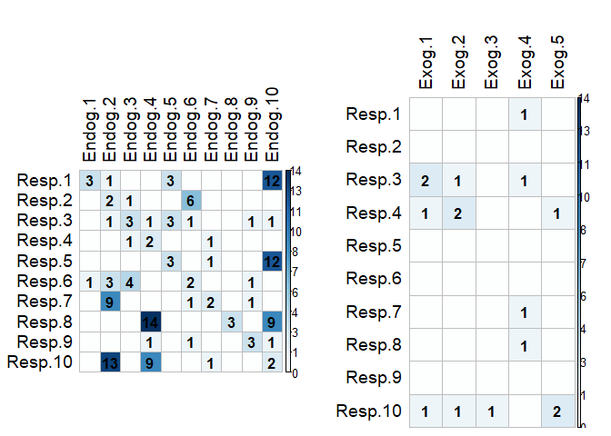
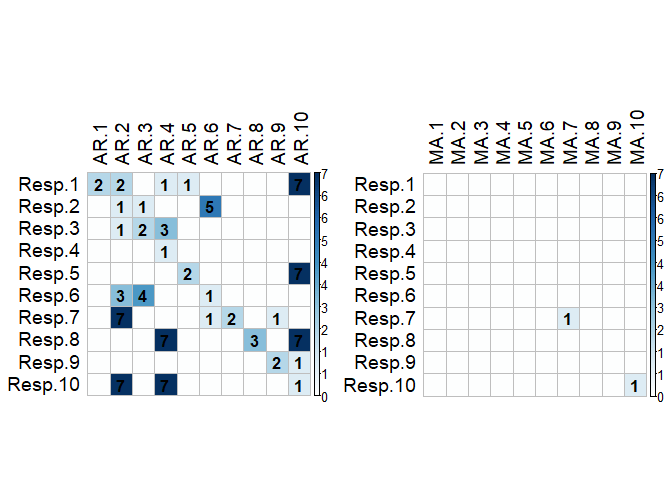
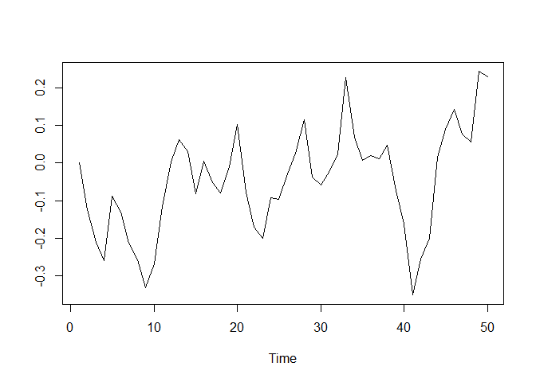
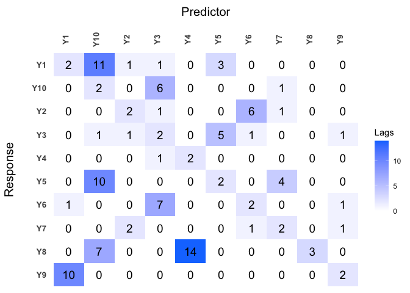
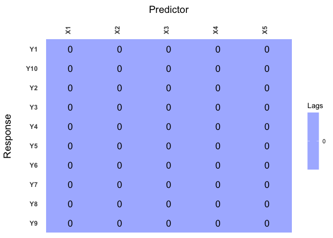
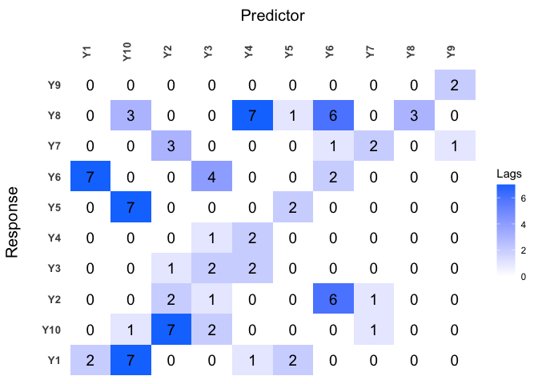
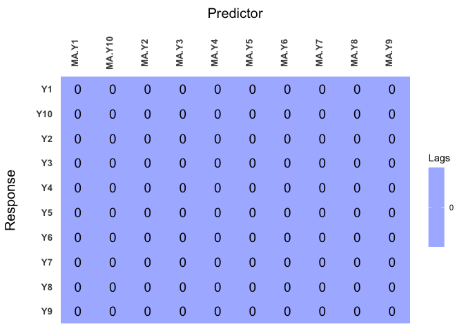

<!-- README.md is generated from README.Rmd. Please edit that file -->

# bigtime: Sparse Estimation of Large Time Series Models

<!-- badges: start -->

[](https://cran.r-project.org/package=bigtime)
[](https://cran.r-project.org/package=bigtime)
[](https://www.gnu.org/licenses/old-licenses/gpl-2.0.html)
[](https://www.gnu.org/licenses/gpl-3.0.html)
<!-- badges: end -->

The goal of `bigtime` is to sparsely estimate large time series models
such as the Vector AutoRegressive (VAR) Model, the Vector AutoRegressive
with Exogenous Variables (VARX) Model, and the Vector AutoRegressive
Moving Average (VARMA) Model. The univariate cases are also supported.

## Installation

You can install bigtime from github a follows:

``` r
# install.packages("devtools")
devtools::install_github("ineswilms/bigtime")
```

## Plotting the data

We will use the time series contained in the `example` data set. The
first ten columns in our dataset are used as endogenous time series in
the VAR and VARMA models, and the last five columns are used as
exogenous time series in the VARX model. Note that we remove the last
observation from our dataset as we will use this one to illustrate how
to evaluate prediction performance. We start by making a plot of our
data.

``` r
library(bigtime)
suppressMessages(library(tidyverse)) # Will be used for nicer visualisations

data(example)
Y <- example[-nrow(example), 1:10] # endogenous time series
colnames(Y) <- paste0("Y", 1:ncol(Y)) # Assigning column names
Ytest <- example[nrow(example), 1:10]
X <- example[-nrow(example), 11:15] # exogenous time series
colnames(X) <- paste0("X", 1:ncol(X)) # Assinging column names


plot_series <- function(Y){
  as_tibble(Y) %>%
  mutate(Time = 1:n()) %>%
  pivot_longer(-Time, names_to = "Series", values_to = "vals") %>%
  ggplot() +
  geom_line(aes(Time, vals)) + 
  facet_wrap(facets = vars(Series), ncol = 2) + 
  ylab("") +
  theme_bw()
}

plot_series(Y)
```

<!-- -->

``` r
plot_series(X)
```

<!-- -->

## Multivariate Time Series Models

### Vector AutoRegressive (VAR) Models

While we could use the example data provided, *bigtime* also supports
simulation of VAR models using both lasso and elementwise type sparsity
patterns. Since lasso is the most widely known one, we will start off
with lasso. To simulate a VAR model having lasso type of sparsity, use
the `simVAR` function and set `sparsity_pattern="lasso"`. The lasso
sparsity pattern has the additional `num_zero` option which determines
the number of zeros in the VAR coefficient matrix (excluding
intercepts). *Note: we also set a seed so that the simulation is
replicatable*. We can then use the `summary` function to obtain a
summary of the simulated data.

``` r
periods <- 200
k <- 5 # Number of time series
p <- 5 # Maximum lag 
sparsity_options <- list(num_zero = 15)
sim_data <- simVAR(periods = periods, k = k, p = p, 
                   sparsity_pattern = "lasso", 
                   sparsity_options = sparsity_options,
                   seed = 123456, 
                   decay = 0.01) # the smaller decay the larger early coefs w.r.t. to later ones
Y <- sim_data$Y
summary(sim_data) # Obtaining a summary of the simulation
#> #### General Information #### 
#> 
#> Seed                      123456 
#> Periods Simulated             200 
#> Periods used as burnin            200 
#> Variables Simulated           5 
#> Number of Lags                5 
#> Coefficients were randomly created?   TRUE 
#> Maximum Eigenvalue of Companion Matrix    0.8 
#> Sparsity Pattern              lasso 
#> 
#> 
#> #### Sparsity Options #### 
#> 
#> $num_zero
#> [1] 15
#> 
#> 
#> 
#> #### Coefficient Matrix #### 
#> 
#>                  Y1            Y2            Y3            Y4            Y5
#> Y1.L1  3.148477e-01 -1.042456e-01 -1.340615e-01  3.303840e-02  0.000000e+00
#> Y2.L1  3.151222e-01  4.956154e-01  9.450891e-01  4.411664e-01 -1.609355e-01
#> Y3.L1 -3.761745e-01 -4.206676e-01 -2.104624e-02  4.435080e-01  0.000000e+00
#> Y4.L1  2.175409e-02 -2.775787e-01  3.514011e-01  6.299766e-01  2.113583e-01
#> Y5.L1 -2.847280e-01  4.745202e-01  1.453617e-02  7.157707e-02  1.746925e-01
#> Y1.L2 -1.613877e-03  6.263472e-05  2.661878e-03  3.670053e-03 -2.343200e-03
#> Y2.L2 -3.232062e-03  2.626773e-04  0.000000e+00 -1.038072e-02 -4.266757e-03
#> Y3.L2 -3.254032e-03  5.891401e-03  3.833340e-03  3.942499e-03 -4.214060e-03
#> Y4.L2 -4.045632e-03  0.000000e+00  6.458806e-04 -3.384564e-03  5.977573e-04
#> Y5.L2 -1.895538e-03 -3.647672e-03 -4.295011e-04  4.100938e-03  0.000000e+00
#> Y1.L3 -6.675556e-05  0.000000e+00  0.000000e+00  5.515982e-05  5.805182e-05
#> Y2.L3 -1.282333e-05 -4.068835e-05 -5.629667e-05 -9.544626e-06 -4.604233e-06
#> Y3.L3 -2.450795e-05  1.182287e-05  4.637770e-06 -3.160211e-05  2.267409e-05
#> Y4.L3 -9.287379e-06 -6.973603e-06  8.744831e-07 -1.830219e-05 -2.786600e-05
#> Y5.L3  0.000000e+00  0.000000e+00 -6.816498e-05  1.655326e-05 -5.442071e-05
#> Y1.L4  0.000000e+00 -2.730242e-07  1.841365e-08 -5.904461e-07  0.000000e+00
#> Y2.L4  4.372888e-07 -2.661335e-07 -5.943320e-07  1.957482e-07 -4.021562e-07
#> Y3.L4  1.776943e-08  3.202533e-07  1.633947e-07  1.974301e-07 -9.587654e-08
#> Y4.L4 -1.876292e-07  4.758596e-07  2.133569e-07 -1.301476e-07  2.737143e-07
#> Y5.L4  3.263123e-07  1.394408e-07  5.980230e-07  2.279804e-08  4.860589e-08
#> Y1.L5 -3.212887e-09  4.148525e-09 -4.555631e-09  2.197322e-09  3.261604e-09
#> Y2.L5  3.712359e-09  0.000000e+00 -4.013350e-12 -3.628743e-09  4.755228e-09
#> Y3.L5 -3.272620e-09  9.404806e-10 -3.254023e-10 -1.861309e-09 -1.015837e-09
#> Y4.L5 -1.507675e-09 -3.566008e-09  0.000000e+00 -1.543414e-09  0.000000e+00
#> Y5.L5  4.470289e-09  0.000000e+00 -8.581552e-09 -7.706071e-09 -2.447106e-09
```

<!-- -->

The above simulated data (and truly any other data) could then be
estimated using an L1-penalty (lasso penalty) on the autoregressive
coefficients. To this end, set the `VARpen` argument in the `sparseVAR`
function equal to L1.

For the selection of the penalisation parameter, we can either set the
`selection` argument to `"none"`, which would return a model for a
sequence of penalisations, or use time series cross-validation by
setting `selection="cv"`, or finally we could also use any of BIC, AIC,
or HQ information criteria by setting the `selection` arguments to any
of `"bic"`, `"aic"`, or `"hq"` respectively. We will start of by using
time series cross-validation and will therefore set `selection="cv"`.
The default is to use a cross-validation score based on one-step ahead
predictions but you can change the default forecast horizon under the
argument `h`. *Note: it is recommended to standardise the data. Bigtime
will give a warning if the data is not standardised but will not stop
you from continuing.*

``` r
VARL1 <- sparseVAR(Y=scale(Y), 
                   selection = "cv", 
                   VARpen = "L1") # Using scale() to standardise data
```

The `plot_cv` function can be used to investigate the cross-validation
procedure. The black line indicates the penalty parameter choice that
lead to the smallest MSFE in the CV procedure. The red line, on the
other hand, shows the one SE optimal penalisation. The latter is the one
that is chosen by `sparseVAR`.

``` r
plot_cv(VARL1)
```

<!-- -->

Further investigation into the model can be done by using the function
`lagmatrix`, which returns the lagmatrix of the estimated autoregressive
coefficients. If entry \((i,j)=x\), this means that the sparse estimator
indicates the effect of time series \(j\) on time series \(i\) to last
for \(x\) periods. Setting the `returnplot` argument to `TRUE` will
return a heatmap for better visual inspection.

``` r
LhatL1 <- lagmatrix(fit=VARL1, returnplot=TRUE)
```

<!-- -->

The lag matrix is typically sparse as it contains some empty (i.e.,
zero) cells. However, VAR models estimated with a standard L1-penalty
are typically not easily interpretable as they select many high lag
order coefficients (i.e., large values in the lagmatrix).

To circumvent this problem, we advise using a lag-based hierarchically
sparse estimation procedure, which boils down to using the default
option HLag for the `VARpen` argument. This estimation procedure
encourages low maximum lag orders, often results in sparser lagmatrices,
and hence more interpretable models.

A VAR with HLag (elementwise) type of sparsity can be simulated using
`simVAR` and by setting `sparsity_pattern="hvar"`. Three extra options
exist: (1) `zero_min` determines the minimum number of zero coefficients
of each variable in each equation, (2) `zero_max` determines the maximum
number of zero coefficients of each variable in each equation, and (3)
`zeroes_in_self` is a boolean option that if TRUE, zero coefficients of
the \(i\)th variable can exist in the \(i\)th equation.

``` r
periods <- 200
k <- 5 # Number of time series
p <- 5 # Maximum lag 
sparsity_options <- list(zero_min = 0, 
                         zero_max = 5, 
                         zeroes_in_self = TRUE)
sim_data <- simVAR(periods = periods, k = k, p = p, 
                   sparsity_pattern = "hvar", 
                   sparsity_options = sparsity_options,
                   seed = 123456, 
                   decay = 0.01)
Y <- sim_data$Y
summary(sim_data) # Obtaining a summary of the simulation
#> #### General Information #### 
#> 
#> Seed                      123456 
#> Periods Simulated             200 
#> Periods used as burnin            200 
#> Variables Simulated           5 
#> Number of Lags                5 
#> Coefficients were randomly created?   TRUE 
#> Maximum Eigenvalue of Companion Matrix    0.8 
#> Sparsity Pattern              hvar 
#> 
#> 
#> #### Sparsity Options #### 
#> 
#> $zero_min
#> [1] 0
#> 
#> $zero_max
#> [1] 5
#> 
#> $zeroes_in_self
#> [1] TRUE
#> 
#> 
#> 
#> #### Coefficient Matrix #### 
#> 
#>                  Y1            Y2            Y3            Y4            Y5
#> Y1.L1  0.000000e+00 -1.032031e-01 -1.327209e-01  3.270802e-02  8.420276e-01
#> Y2.L1  3.119710e-01  4.906592e-01  9.356382e-01  4.367547e-01 -1.593261e-01
#> Y3.L1 -3.724128e-01 -4.164610e-01 -2.083578e-02  4.390729e-01  3.937560e-01
#> Y4.L1  2.153655e-02 -2.748029e-01  3.478871e-01  0.000000e+00  2.092447e-01
#> Y5.L1 -2.818808e-01  4.697750e-01  1.439081e-02  7.086130e-02  1.729456e-01
#> Y1.L2  0.000000e+00  0.000000e+00  2.635259e-03  3.633353e-03 -2.319768e-03
#> Y2.L2 -3.199742e-03  2.600505e-04  0.000000e+00 -1.027691e-02 -4.224090e-03
#> Y3.L2 -3.221492e-03  5.832487e-03  0.000000e+00  3.903074e-03 -4.171920e-03
#> Y4.L2  0.000000e+00  3.618292e-03  6.394217e-04  0.000000e+00  5.917797e-04
#> Y5.L2 -1.876583e-03 -3.611195e-03 -4.252061e-04  4.059929e-03 -4.529864e-03
#> Y1.L3  0.000000e+00  0.000000e+00  1.201831e-05  0.000000e+00  5.747130e-05
#> Y2.L3 -1.269510e-05 -4.028146e-05  0.000000e+00 -9.449180e-06 -4.558191e-06
#> Y3.L3 -2.426287e-05  1.170464e-05  0.000000e+00 -3.128609e-05  2.244735e-05
#> Y4.L3  0.000000e+00  0.000000e+00  0.000000e+00  0.000000e+00 -2.758734e-05
#> Y5.L3  0.000000e+00  2.110436e-05 -6.748333e-05  1.638772e-05 -5.387651e-05
#> Y1.L4  0.000000e+00  0.000000e+00  1.822951e-08  0.000000e+00 -8.607620e-07
#> Y2.L4  4.329159e-07 -2.634722e-07  0.000000e+00  0.000000e+00 -3.981346e-07
#> Y3.L4  0.000000e+00  3.170507e-07  0.000000e+00  1.954558e-07 -9.491777e-08
#> Y4.L4  0.000000e+00  0.000000e+00  0.000000e+00  0.000000e+00  0.000000e+00
#> Y5.L4  0.000000e+00  1.380464e-07  5.920428e-07  0.000000e+00  4.811983e-08
#> Y1.L5  0.000000e+00  0.000000e+00  0.000000e+00  0.000000e+00  3.228988e-09
#> Y2.L5  0.000000e+00  0.000000e+00  0.000000e+00  0.000000e+00  0.000000e+00
#> Y3.L5  0.000000e+00  0.000000e+00  0.000000e+00 -1.842696e-09 -1.005678e-09
#> Y4.L5  0.000000e+00  0.000000e+00  0.000000e+00  0.000000e+00  0.000000e+00
#> Y5.L5  0.000000e+00 -6.013512e-09 -8.495736e-09  0.000000e+00  0.000000e+00
```

<!-- -->

Models can be estimated using the hierarchical penalisation by using the
default argument to `VARpen`, namely `HLag`. Model selection can again
be done by either setting `selection="none"` and obtaining a whole
sequence of models, or by using any of `cv, bic, aic, hq`.

``` r
VARHLag_none <- sparseVAR(Y=scale(Y), selection = "none") # HLag is the dafault VARpen option
VARHLag_cv <- sparseVAR(Y=scale(Y), selection = "cv")
VARHLag_bic <- sparseVAR(Y=scale(Y), selection = "bic") # This will also give a table for IC comparison
#> 
#> 
#> #### Selected the following ####
#> 
#>      AIC      BIC       HQ 
#> 10.74023 10.74023 10.74023 
#> 
#> 
#> #### Details ####
#> 
#>      lambda         AIC         BIC          HQ
#> 1  138.7154     -0.9793     -0.9793     -0.9793
#> 2   83.1577     -1.7792     -1.6473     -1.7258
#> 3   49.8517     -3.0055     -2.7746      -2.912
#> 4   29.8853     -4.1453     -3.8155     -4.0118
#> 5   17.9158      -4.826     -4.4631     -4.6791
#> 6   10.7402 ==> -5.0769 ==> -4.6151   ==> -4.89
#> 7    6.4386     -5.0698     -4.3277     -4.7695
#> 8    3.8598     -4.6703     -3.0377     -4.0096
#> 9    2.3139     -2.7531      2.5737     -0.5974
#> 10   1.3872     -1.5512      6.5956      1.7457
```

Depending on which selection procedure was used, various diagnostics can
be produced. Former and foremost, all selection procedures support the
`fitted` and `residuals` functions to obtain the fitted and residual
values respectively. Both functions return a 3D array if the model used
`selection="none"` correpoding to the fitted/residual values for each
model in the penalisation sequence.

``` r
res_VARHLag_none <- residuals(VARHLag_none) # This is a 3D array
dim(res_VARHLag_none)
#> [1] 179   5  10
```

When an actual selection method was used (`cv, bic, aic, hq`), then
other diagnostic functions exist. For `cv`, `plot_cv` could be used
again, just as shown above. For all, the `diagnostics_plot` function can
be used to obtain a plot of fitted and residual values.

``` r
p_bic <- diagnostics_plot(VARHLag_bic, variable = "Y3") # variable argument can be numeric or character
p_cv <- diagnostics_plot(VARHLag_cv, variable = "Y3") # variable argument can be numeric or character

plot(p_bic)
```

<!-- -->

``` r
plot(p_cv)
```

<!-- -->

### Vector AutoRegressive with Exogenous Variables (VARX) Models

``` r
data(example)
Y <- example[-nrow(example), 1:10] # endogenous time series
colnames(Y) <- paste0("Y", 1:ncol(Y)) # Assigning column names
Ytest <- example[nrow(example), 1:10]
Ytest <- (Ytest-apply(Y, 2, mean))/apply(Y, 2, sd) # Needed because we standardise data
X <- example[-nrow(example), 11:15] # exogenous time series
colnames(X) <- paste0("X", 1:ncol(X)) # Assinging column names
```

Often practitioners are interested in incorparating the impact of
unmodeled exogenous variables (X) into the VAR model. To do this, you
can use the `sparseVARX` function which has an argument `X` where you
can enter the data matrix of exogenous time series.

When applying the `lagmatrix` function to an estimated sparse VARX
model, the lag matrices of both the endogenous and exogenous
autoregressive coefficients are returned.

`sparseVARX` supports the same `selection` arguments as `sparseVAR`:
`none, cv, bic, aic, hq`, and it is again recommended to standardise the
data.

``` r
VARXfit_cv <- sparseVARX(Y=scale(Y), X=scale(X), selection = "cv")
LhatVARX <- lagmatrix(fit=VARXfit_cv, returnplot=TRUE)
```

<!-- --><!-- -->

VARX models also support `plot_cv` if estimated using CV. The big black
dot in the plot below indicates the SE optimal choice, while the
contours indicate the mean MSFE in the CV procedure.

``` r
plot_cv(VARXfit_cv)
```

<!-- -->

If `selection="none"` a 3D array will be returned again. Although not
mentioned previously, when setting `selection` to `none`, or any of the
IC, one can also easily provide a penalisation sequence, or even just
ask for a single penalisation setting. For example, below we
intentionally choose a single, small penalisation for the exogenous
variables.

``` r
VARXfit_none <- sparseVARX(Y=scale(Y), X=scale(X), VARXlBseq = 0.001, selection = "none")
dim(VARXfit_none$Phihat) # This is a 3D array
#> [1]  10 140  10
# This is also 3D but third dimension is equal to ten 
# --> one penalisation was chosen for B and 10 automatically for Phi
# --> Cross product makes 10
dim(VARXfit_none$Bhat) 
#> [1] 10 70 10
```

Other functions such as `residuals`, `fitted`, and `diagnostics_plot`
are also supported.

### Vector AutoRegressive Moving Average (VARMA) Models

VARMA models generalise VAR models and often allow for more parsimonious
representations of the data generating process. To estimate a VARMA
model to a multivariate time series data set, use the function
`sparseVARMA`, and choose a desired selection method. As a default,
`sparseVARMA` uses CV in the first stage and `none` in the second stage.
**The first stage does not support `none`: A selection needs to be
made.**

Now lag matrices are obtained for the autoregressive (AR) coefficients
and the moving average (MAs) coefficients.

``` r
VARMAfit <- sparseVARMA(Y=scale(Y), VARMAselection = "cv") # VARselection="cv" as default.  
LhatVARMA <- lagmatrix(fit=VARMAfit, returnplot=T)
```

<!-- --><!-- -->

Other functions such as `plot_cv`, `residuals`, `fitted` and
`diagnosticsplot` are also supported.

## Evaluating Forecast Performance

To obtain forecasts from the estimated models, you can use the
`directforecast` function for VAR, VARMA, and VARX, or the
`recursiveforecast` function for VAR models. The default forecast
horizon (argument `h`) is set to one such that one-step ahead forecasts
are obtained, but you can specify your desired forecast horizon.

Finally, we compare the forecast accuracy of the different models by
comparing their forecasts to the actual time series values. We will
estimate all models using CV.

In this example, the VARMA model has the best forecast performance
(i.e., lowest mean squared prediction error). This is no surprise as the
multivariate time series \(Y\) was generated from a VARMA model.

``` r
VARcv <- sparseVAR(Y = scale(Y), selection = "cv")
VARMAcv <- sparseVARMA(Y = scale(Y), VARMAselection = "cv")
VARXcv <- sparseVARX(Y = scale(Y), X = scale(X), selection = "cv")

VARf <- directforecast(VARcv) # default is h=1
VARXf <- directforecast(VARXcv)
VARMAf <- directforecast(VARMAcv)

mean((VARf-Ytest)^2)
#> [1] 0.5000718
mean((VARXf-Ytest)^2)
#> [1] 0.4441901
mean((VARMAf-Ytest)^2) # lowest=best
#> [1] 0.372068
```

Note that we could easily obtain longer horizon forecasts for the VAR
model by using the `recursiveforecast` function. It is recommended to
call `is.stable` first though, to check whether the obtained VAR model
is stable.

``` r
is.stable(VARcv)
#> [1] TRUE
rec_fcst <- recursiveforecast(VARcv, h = 10)
plot(rec_fcst, series = "Y2", last_n = 50) # Plotting of a recursive forecast
```

<!-- -->

## Univariate Models

The functions `sparseVAR`, `sparseVARX`, `sparseVARMA` can also be used
for the univariate setting where the response time series \(Y\) is
univariate. Below we illustrate the usefulness of the sparse estimation
procedure as automatic lag selection procedures.

### AutoRegressive (AR) Models

We start by generating a time series of length \(n=50\) from a
stationary AR model and by plotting it. The `sparseVAR` function can
also be used in the univariate case as it allows the argument `Y` to be
a vector.

The `lagmatrix` function gives the selected autoregressive order of the
sparse AR model. The true order is one.

``` r
periods <- 50
k <- 1
p <- 1
sim_data <- simVAR(periods, k, p, 
                   sparsity_pattern = "none", 
                   max_abs_eigval = 0.5, 
                   seed = 123456)
summary(sim_data)
#> #### General Information #### 
#> 
#> Seed                      123456 
#> Periods Simulated             50 
#> Periods used as burnin            50 
#> Variables Simulated           1 
#> Number of Lags                1 
#> Coefficients were randomly created?   TRUE 
#> Maximum Eigenvalue of Companion Matrix    0.5 
#> Sparsity Pattern              none 
#> 
#> 
#> #### Sparsity Options #### 
#> 
#> NULL
#> 
#> 
#> #### Coefficient Matrix #### 
#> 
#>           [,1]
#> [1,] 0.4998982
```

<!-- -->

``` r
y <- scale(sim_data$Y)
ARfit <- sparseVAR(Y=y, selection = "cv")
lagmatrix(ARfit)
#> $LPhi
#>      [,1]
#> [1,]    1
```

*Note that all diagnostics functions discussed for the VAR, VARMA, VARX
cases also work for univariate cases; so do the forecasting functions*

### AutoRegressive with Exogenous Variables (ARX) Models

We start by generating a time series of length \(n=50\) from a
stationary ARX model and by plotting it. The `sparseVARX` function can
also be used in the univariate case as it allows the arguments `Y` and
`X` to be vectors. The `lagmatrix` function gives the selected
endogenous (under `LPhi`) and exogenous autoregressive (under `LB`)
orders of the sparse ARX model. The true orders are one.

``` r

periods <- 50
k <- 1
p <- 1
burnin <- 100
Xsim <- simVAR(periods+burnin, k, p, max_abs_eigval = 0.8, seed = 123)
edist <- Xsim$Y + rnorm(periods + burnin, sd = 0.1)
Ysim <- simVAR(periods, k , p, max_abs_eigval = 0.5, seed = 789, 
               e_dist = t(edist), burnin = burnin)
plot(Ysim)
```

<!-- -->

``` r

x <- scale(Xsim$Y[-(1:burnin)])
y <- scale(Ysim$Y)

ARXfit <- sparseVARX(Y=y, X=x, selection = "cv")
lagmatrix(fit=ARXfit)
#> $LPhi
#>      [,1]
#> [1,]    0
#> 
#> $LB
#>      [,1]
#> [1,]    2
```

### AutoRegressive Moving Average (ARMA) Models

We start by generating a time series of length \(n=50\) from a
stationary ARMA model and by plotting it. The `sparseVARMA` function can
also be used in the univariate case as it allows the argument `Y` to be
a vector. The `lagmatrix` function gives the selected autoregressive
(under `LPhi`) and moving average (under `LTheta`) orders of the sparse
ARMA model. The true orders are one.

``` r

periods <- 50
k <- 1
p.u <- 1
p.y <- 1
burnin <- 100

u <- rnorm(periods + 1 + burnin, sd = 0.1)
u <- embed(u, dimension = p.u + 1)
u <- u * matrix(rep(c(1, 0.2), nrow(u)), nrow =  nrow(u), byrow = TRUE) # Second column is lagged, first is current error
edist <- rowSums(u)

Ysim <- simVAR(periods, k, p, e_dist = t(edist), 
               max_abs_eigval = 0.5, seed = 789, 
               burnin = burnin)
summary(Ysim)
#> #### General Information #### 
#> 
#> Seed                      789 
#> Periods Simulated             50 
#> Periods used as burnin            100 
#> Variables Simulated           1 
#> Number of Lags                1 
#> Coefficients were randomly created?   TRUE 
#> Maximum Eigenvalue of Companion Matrix    0.5 
#> Sparsity Pattern              none 
#> 
#> 
#> #### Sparsity Options #### 
#> 
#> NULL
#> 
#> 
#> #### Coefficient Matrix #### 
#> 
#>           [,1]
#> [1,] 0.4989384
```

<!-- -->

``` r

ARMAfit <- sparseVARMA(Y=y, VARMAselection = "cv")
lagmatrix(fit=ARMAfit)
#> $LPhi
#>      [,1]
#> [1,]    0
#> 
#> $LTheta
#>      [,1]
#> [1,]    3
```

## Additional Resources

For a non-technical introduction to VAR models see this interactive
[notebook](https://mybinder.org/v2/gh/enweg/SnT_VARS/main?urlpath=shiny/App/)
and for an interactive notebook demonstrating the use of BigTime for
high-dimensional VARs, see this
[notebook](https://mybinder.org/v2/gh/enweg/SnT_BigTime/main?urlpath=shiny/App/).
*Note: Loading these notebooks sometimes can take quite some time.
Please be patient or try another time.*

## References:

  - Nicholson William B., Bien Jacob and Matteson David S. (2020),
    “High-dimensional forecasting via interpretable vector
    autoregression”, Journal of Machine Learning Research, 21(166),
    1-52.

  - Wilms Ines, Sumanta Basu, Bien Jacob and Matteson David S. (2017),
    “Sparse Identification and Estimation of High-Dimensional Vector
    AutoRegressive Moving Averages”, arXiv:1707.09208.

  - Wilms Ines, Sumanta Basu, Bien Jacob and Matteson David S. (2017),
    “Interpretable Vector AutoRegressions with Exogenous Time Series”,
    arXiv.
