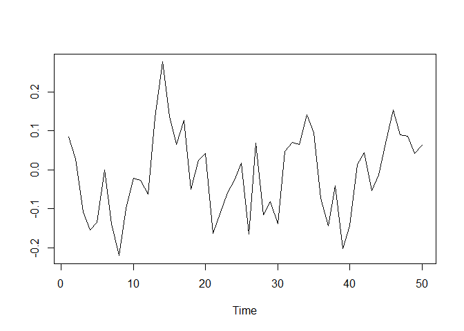

<!-- README.md is generated from README.Rmd. Please edit that file -->
bigtime
=======

The goal of `bigtime` is to sparsely estimate large time series models such as the Vector AutoRegressive (VAR) Model, the Vector AutoRegressive with Exogenous Variables (VARX) Model, and the Vector AutoRegressive Moving Average (VARMA) Model. The univariate cases are also supported.

Installation
------------

You can install bigtime from github a follows:

``` r
# install.packages("devtools")
devtools::install_github("ineswilms/bigtime")
```

Plotting the data
-----------------

We will use the time series contained in the `example` data set. The first ten columns in our dataset are used as endogenous time series in the VAR and VARMA models, and the last five columns are used as exogenous time series in the VARX model. Note that we remove the last observation from our dataset as we will use this one to illustrate how to evaluate prediction performance. We start by making a plot of our data.

``` r
library(bigtime)
data(example)
Y <- example[-nrow(example), 1:10] # endogenous time series
Ytest <- example[nrow(example), 1:10]
X <- example[-nrow(example), 11:15] # exogenous time series

par(mfrow=c(5,2), mar=c(2.5, 2.5, 1, 1))
for(i in 1:ncol(Y)){
  plot(Y[,i], type="l", ylab="", xlab="Time", main=paste("Endogenous Time series", i))
}
```


``` r

par(mfrow=c(3,2), mar=c(2.5, 2.5, 1, 1))
for(i in 1:ncol(X)){
  plot(X[,i], type="l", ylab="", xlab="Time", main=paste("Exogenous Time series", i))
}
```


Multivariate Time Series Models
-------------------------------

### Vector AutoRegressive (VAR) Models

To make estimation of large VAR models feasible, one could start by using an L1-penalty (lasso penalty) on the autoregressive coefficients. To this end, set the `VARpen` argument in the `sparseVAR` function equal to L1. A time-series cross-validation procedure is used to select the sparsity parameters. The default is to use a cross-validation score based on one-step ahead predictions but you can change the default forecast horizon under the argument `h`. The function `lagmatrix` returns the lagmatrix of the estimated autoregressive coefficients. If entry (*i*, *j*)=*x*, this means that the sparse estimator indicates the effect of time series *j* on time series *i* to last for *x* periods.

``` r
VARL1 <- sparseVAR(Y=Y, VARpen="L1") # default forecast horizon is h=1
par(mfrow=c(1, 1))
LhatL1 <- lagmatrix(fit=VARL1, model="VAR", returnplot=T)
```


The lag matrix is typically sparse as it contains soms empty (i.e., zero) cells. However, VAR models estimated with a standard L1-penalty are typically not easily interpretable as they select many high lag order coefficients (i.e., large values in the lagmatrix).

To circumvent this problem, we advise using a lag-based hierarchically sparse estimation procedure, which boils down to using the default option HLag for the `VARpen` argument. This estimation procedures encourages low maximum lag orders, often results in sparser lagmatrices, and hence more interpretable models:

``` r
VARHLag <- sparseVAR(Y=Y) # VARpen="HLag" is the default
par(mfrow=c(1, 1))
LhatHLag <- lagmatrix(fit=VARHLag, model="VAR", returnplot=T)
```


### Vector AutoRegressive with Exogenous Variables (VARX) Models

Often practitioners are interested in incorparating the impact of unmodeled exogenous variables (X) into the VAR model. To do this, you can use the `sparseVARX` function which has an argument `X` where you can enter the data matrix of exogenous time series. When applying the `lagmatrix` function to an estimated sparse VARX model, the lag matrices of both the endogenous and exogenous autoregressive coefficients are returned.

``` r
VARXfit <- sparseVARX(Y=Y, X=X) 
par(mfrow=c(1, 2))
LhatVARX <- lagmatrix(fit=VARXfit, model="VARX", returnplot=T)
```


### Vector AutoRegressive Moving Average (VARMA) Models

VARMA models generalized VAR models and often allow for more parsimonious representations of the data generating process. To estimate a VARMA model to a multivariate time series data set, use the function `sparseVARMA`. Now lag matrices are obtained for the autoregressive (AR) coefficients and the moving average (MAs) coefficients.

``` r
VARMAfit <- sparseVARMA(Y=Y) 
par(mfrow=c(1, 2))
LhatVARMA <- lagmatrix(fit=VARMAfit, model="VARMA", returnplot=T)
```


Evaluating Forecast Performance
-------------------------------

To obtain forecasts from the estimated models, you can use the `directforecast` function. The default forecast horizon (argument `h`) is set to one such that one-step ahead forecasts are obtained, but you can specify your desired forecast horizon. Finally, we compare the forecast accuracy of the different models by comparing their forecasts to the actual time series values. In this example, the VARMA model has the best forecast performance (i.e., lowest mean squared prediction error). This is no surprise as the multivariate time series *Y* was generated from a VARMA model.

``` r
VARf <- directforecast(VARHLag, model="VAR") # default is h=1
VARXf <- directforecast(VARXfit, model="VARX")
VARMAf <- directforecast(VARMAfit, model="VARMA")

mean((VARf-Ytest)^2)
#> [1] 2.448348
mean((VARXf-Ytest)^2)
#> [1] 2.506801
mean((VARMAf-Ytest)^2) # lowest=best
#> [1] 1.889274
```

Univariate Models
-----------------

The functions `sparseVAR`, `sparseVARX`, `sparseVARMA` can also be used for the univariate setting where the response time series *Y* is univariate. Below we illustrate the usefulness of the sparse estimation procedure as automatic lag selection procedures.

### AutoRegressive (AR) Models

We start by generating a time series of length *n* = 50 from a stationary AR model and by plotting it. The `sparseVAR` function can also be used in the univariate case as it allows the argument `Y` to be a vector. The `lagmatrix` function gives the selected autoregressive order of the sparse AR model. The true order is one.

``` r
n <- 50
y <- rep(NA, n)
y[1] <- rnorm(1, sd=0.1)
for(i in 2:n){
  y[i] <- 0.5*y[i-1] + rnorm(1, sd=0.1)
}
par(mfrow=c(1,1))
plot(y, type="l", xlab="Time", ylab="")
```


``` r
ARfit <- sparseVAR(Y=y) 
lagmatrix(fit=ARfit, model="VAR")
#> $LPhi
#>      [,1]
#> [1,]    1
```

### AutoRegressive with Exogenous Variables (ARX) Models

We start by generating a time series of length *n* = 50 from a stationary ARX model and by plotting it. The `sparseVARX` function can also be used in the univariate case as it allows the arguments `Y` and `X` to be vectors. The `lagmatrix` function gives the selected endogenous (under `LPhi`) and exogenous autoregressive (under `LB`) orders of the sparse ARX model. The true orders are one.

``` r
n <- 50
y  <- x <- rep(NA, n)
x[1] <- rnorm(1, sd=0.1)
y[1]  <- rnorm(1, sd=0.1)
for(i in 2:n){
  x[i] <- 0.8*x[i-1] + rnorm(1, sd=0.1)
  y[i] <- 0.5*y[i-1] + 0.2*x[i-1] + rnorm(1, sd=0.1)
}
par(mfrow=c(1,1))
plot(y, type="l", xlab="Time", ylab="")
```



``` r
ARXfit <- sparseVARX(Y=y, X=x) 
lagmatrix(fit=ARXfit, model="VARX")
#> $LPhi
#>      [,1]
#> [1,]    1
#> 
#> $LB
#>      [,1]
#> [1,]    4
```

### AutoRegressive Moving Average (ARMA) Models

We start by generating a time series of length *n* = 50 from a stationary ARMA model and by plotting it. The `sparseVARMA` function can also be used in the univariate case as it allows the argument `Y` to be a vector. The `lagmatrix` function gives the selected autoregressive (under `LPhi`) and moving average (under `LTheta`) orders of the sparse ARMA model. The true orders are one.

``` r
n <- 50
y <- u <- rep(NA, n)
y[1] <- rnorm(1, sd=0.1)
u[1] <- rnorm(1, sd=0.1)
for(i in 2:n){
  u[i] <- rnorm(1, sd=0.1)
  y[i] <- 0.5*y[i-1] + 0.2*u[i-1] + u[i]
}
par(mfrow=c(1,1))
plot(y, type="l", xlab="Time", ylab="")
```


``` r
ARMAfit <- sparseVARMA(Y=y) 
lagmatrix(fit=ARMAfit, model="VARMA")
#> $LPhi
#>      [,1]
#> [1,]    1
#> 
#> $LTheta
#>      [,1]
#> [1,]    1
```

References:
-----------

-   Nicholson William B., Bien Jacob and Matteson David S. (2017), "High Dimensional Forecasting via Interpretable Vector Autoregression", arXiv:1412.5250v2.

-   Wilms Ines, Sumanta Basu, Bien Jacob and Matteson David S. (2017), "Sparse Identification and Estimation of High-Dimensional Vector AutoRegressive Moving Averages", arXiv:1707.09208.

-   Wilms Ines, Sumanta Basu, Bien Jacob and Matteson David S. (2017), "Interpretable Vector AutoRegressions with Exogenous Time Series", arXiv.
